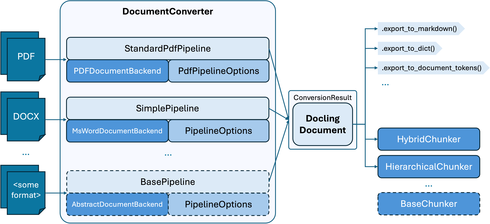

In a nutshell, Docling's architecture is outlined in the diagram above.

For each document format, the *document converter* knows which format-specific *backend* to employ for parsing the document and which *pipeline* to use for orchestrating the execution, along with any relevant *options*.

!!! tip

    While the document converter holds a default mapping, this configuration is parametrizable, so e.g. for the PDF format, different backends and different pipeline options can be used — see [Usage](../usage/index.md#adjust-pipeline-features).

The *conversion result* contains the [*Docling document*](./docling_document.md), Docling's fundamental document representation.

Some typical scenarios for using a Docling document include directly calling its *export methods*, such as for markdown, dictionary etc., or having it chunked by a [*chunker*](./chunking.md).

For more details on Docling's architecture, check out the [Docling Technical Report](https://arxiv.org/abs/2408.09869).

!!! note

    The components illustrated with dashed outline indicate base classes that can be subclassed for specialized implementations.
